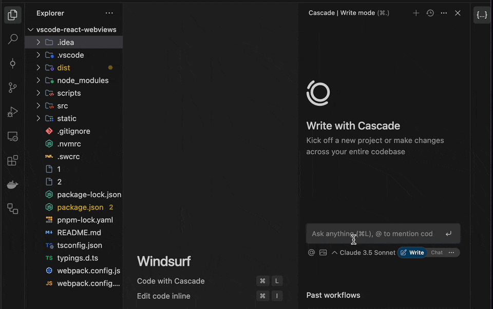

# Index Hidden Files

A VSCode extension that helps index files for Windsurf and similar applications by automatically opening and closing files recursively.



## Features

- 🔍 Recursively opens and closes files in selected directories
- 🎯 Right-click menu integration for easy access
- ⚡ Fast indexing with configurable delay
- 🚫 Intelligent file type filtering
- 📊 Progress indication during indexing

## Installation

1. Install the extension from VSCode marketplace
2. Restart VSCode

## Usage

1. Right-click on any file or folder in the VSCode explorer
2. Select "Index Files for Windsurf" from the context menu
3. Wait for the indexing process to complete

## Technical Details

The extension:
- Uses VSCode's workspace API for file operations
- Implements smart file filtering (ignores binary files)
- Maintains a small memory footprint
- Closes files automatically after indexing

## Configuration

Default ignored file extensions:
- `.exe`
- `.dll`
- `.jpg`
- `.png`
- `.gif`

## Development

```bash
# Install dependencies
pnpm install

# Run tests
pnpm test

# Package extension
pnpm run package
```

## License

MIT

## Following extension guidelines

Ensure that you've read through the extensions guidelines and follow the best practices for creating your extension.

* [Extension Guidelines](https://code.visualstudio.com/api/references/extension-guidelines)

## Working with Markdown

You can author your README using Visual Studio Code. Here are some useful editor keyboard shortcuts:

* Split the editor (`Cmd+\` on macOS or `Ctrl+\` on Windows and Linux).
* Toggle preview (`Shift+Cmd+V` on macOS or `Shift+Ctrl+V` on Windows and Linux).
* Press `Ctrl+Space` (Windows, Linux, macOS) to see a list of Markdown snippets.

## For more information

* [Visual Studio Code's Markdown Support](http://code.visualstudio.com/docs/languages/markdown)
* [Markdown Syntax Reference](https://help.github.com/articles/markdown-basics/)

**Enjoy!**
